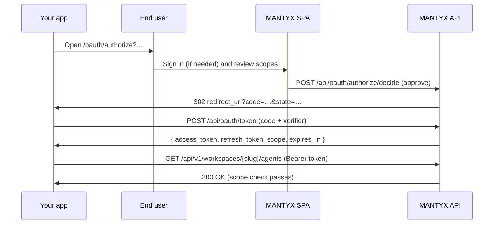

# OAuth 2.0 in MANTYX

MANTYX exposes an OAuth 2.0 authorization server at **`/api/oauth/...`** that
issues access tokens accepted on every existing API surface
(`/api/v1`, `/api/a2a`, `/mcp`) plus a small identity endpoint
(`/api/oauth/userinfo`).

OAuth tokens are a **drop-in alternative to workspace API keys** — same
HTTP contract, same `Authorization: Bearer …` header, same per-agent
allowlist semantics. The only thing that changes is that the token
carries **scopes**: per-route permissions you grant at consent time
instead of the coarse `ApiKeyUsage` (`mcp` | `developer_api` | `a2a`)
on classic workspace API keys.

> See `architecture.md` for the full request pipeline and where the
> bearer resolver sits in it.

## When to use OAuth vs. an API key

* **Personal scripts and internal tools you control end-to-end** — keep
  using a workspace API key. It's one click to issue, one header to set.
* **Apps that other people sign in to** — register an OAuth application
  and run the Authorization Code + PKCE flow. End users approve specific
  scopes for a specific workspace. Two visibility modes:
  * **Private** — locked to the workspace that registered the app. Only
    members of that workspace can authorize. Optionally enable
    `client_credentials` for unattended machine-to-machine traffic.
  * **Public** — any user can authorize the app and pick the workspace
    they want to grant access to on the consent screen.

## High-level flow



## Registering an application

Open **Developer → OAuth apps** (workspace admins only). Both private and
public apps are registered from this page; the Visibility radio decides
which flow you get.

Provide:

* **Name** and **description** (shown on the consent screen).
* **Logo URL** (optional).
* **Visibility** — **Private** locks tokens to this workspace; **Public**
  lets any signed-in user pick a workspace at consent time.
* **Redirect URIs** — at least one. Allowed schemes:
  * `https://…`
  * `http://localhost`, `http://127.0.0.1`, or `http://[::1]` (any port,
    any path)
  * Custom schemes for native apps, e.g. `myapp://callback`.
* **Allowed scopes** — only scopes you check here can be requested by
  the application at consent time.
* **Client secret** — every MANTYX OAuth app is a **confidential
  client**. The `client_secret` is returned **once** on creation; the
  `/token`, `/revoke`, and `/introspect` endpoints all require the
  matching value. We do not support PKCE-only public-client
  registrations — visibility (private vs. public) only controls *who*
  can authorize the app, not whether the app keeps a secret. PKCE is
  still mandatory on top of the secret for defense in depth (see
  below).
* **Allow `client_credentials` grant** *(private apps only)* — for
  unattended machine-to-machine use; not available on public apps
  because the token has to be bound to a single workspace at mint time.

The `client_id` is `mantyx_oa_<id>`. Confidential client secrets are
`mantyx_oas_<secret>`.

OAuth applications require the **`oauthApps`** feature on the registering
workspace's tier (mirrors the existing `apiKeys` plan check). For public
apps the same gate is also applied to the workspace each end user picks
at consent time, so a free workspace can't host paid features through
a public app authorized for it.

## Authorization Code + PKCE (browser, native, server-side)

Every grant carries **two** client-binding factors:

* `client_secret` — proves the registered client made the call (every
  MANTYX OAuth app is confidential, so this is always required).
* PKCE `code_verifier` — proves the same browser session that started
  `/authorize` is finishing the exchange. We accept only `S256` and
  reject any token request without a verifier.

1. Generate a high-entropy `code_verifier` (43–128 chars, RFC 7636).
2. Compute `code_challenge = base64url(sha256(code_verifier))` (no
   padding).
3. Send the user to:

   ```text
   GET /api/oauth/authorize
       ?client_id=mantyx_oa_…
       &redirect_uri=<exact registered URI>
       &response_type=code
       &scope=mantyx.identity:read+agents:read+runs:write
       &state=<random per-session token>
       &code_challenge=<S256 challenge>
       &code_challenge_method=S256
   ```

   The MANTYX SPA at `/oauth/authorize` reads the same query, asks the
   user to log in if needed, lets them pick the workspace (third-party
   apps), pick the agent allow-list (when any of `agents:invoke`,
   `runs:write`, `a2a:invoke`, `mcp:connect` are requested), and then
   approves or denies.

4. On approve we redirect to:

   ```text
   <redirect_uri>?code=<auth code>&state=<your state>
   ```

   On deny:

   ```text
   <redirect_uri>?error=access_denied&state=<your state>
   ```

5. Exchange the code:

   ```http
   POST /api/oauth/token
   Content-Type: application/x-www-form-urlencoded

   grant_type=authorization_code
   &code=…
   &redirect_uri=<exact same URI>
   &client_id=mantyx_oa_…
   &client_secret=mantyx_oas_…
   &code_verifier=<original verifier>
   ```

   Response:

   ```json
   {
     "access_token": "mantyx_at_…",
     "token_type": "Bearer",
     "expires_in": 3600,
     "refresh_token": "mantyx_rt_…",
     "scope": "mantyx.identity:read agents:read runs:write"
   }
   ```

6. Use the access token like any other workspace bearer:

   ```http
   GET /api/v1/workspaces/<slug>/agents
   Authorization: Bearer mantyx_at_…
   ```

   `<slug>` must be the workspace the consent was for. OAuth tokens
   issued for workspace A return **403** on `/api/v1/workspaces/B/...`.

7. **Token lifetimes.**

   * Access tokens live **1 hour** (`expires_in: 3600`).
   * Refresh tokens are **persistent and non-rotating**: they never
     time-expire. They stop working only when the application access
     is explicitly revoked via `/oauth/revoke` (with the refresh
     token), `DELETE /api/oauth/grants/:id`, or deletion of the
     OAuth application itself.
   * Calling `grant_type=refresh_token` mints a brand-new short-lived
     access token and **echoes back the same refresh token** the
     client already holds. The previous access tokens are **not**
     revoked — multiple backend workers can mint live access tokens
     off a shared refresh without invalidating each other's chains.

   ```http
   POST /api/oauth/token

   grant_type=refresh_token
   &refresh_token=mantyx_rt_…
   &client_id=mantyx_oa_…
   &client_secret=mantyx_oas_…
   &scope=runs:write              # optional narrowing (must be a subset)
   ```

   ```json
   {
     "access_token": "mantyx_at_…",
     "token_type": "Bearer",
     "expires_in": 3600,
     "refresh_token": "<same value the client just sent>",
     "scope": "runs:write"
   }
   ```

   Clients should persist the refresh token once at first sign-in
   (treat it as long-lived) and only refresh the access token from
   it as needed.

8. **Revoke (RFC 7009).**

   ```http
   POST /api/oauth/revoke

   token=<access or refresh token>
   &client_id=mantyx_oa_…
   &client_secret=mantyx_oas_…
   ```

   Always returns `200`, even when the token is unknown — by design.

   * Revoking an **access token** kills only that single access
     token. Other access tokens minted from the same refresh keep
     working until they expire (or until the refresh is revoked).
   * Revoking a **refresh token** kills the refresh and *every* live
     access token tied to its grant in one shot.

## Client credentials (private workspace apps, machine-to-machine)

Private workspace applications with `allowsClientCredentials: true` can
request a token without a user:

```http
POST /api/oauth/token

grant_type=client_credentials
&client_id=mantyx_oa_…
&client_secret=mantyx_oas_…
&scope=runs:write+agents:invoke   # optional, must be a subset of allowedScopes
```

The token's `tenantId` is the application's owning workspace and its
agent allow-list defaults to every non-system agent in that workspace
(no end-user consent screen). Use this for cron jobs, internal services
and partner integrations where there is no end user.

## "Sign in with MANTYX"

There is **no OIDC** today. The access token is enough:

1. Run the auth-code + PKCE flow with `scope=mantyx.identity:read`.
2. Call:

   ```http
   GET /api/oauth/userinfo
   Authorization: Bearer mantyx_at_…
   ```

   Response:

   ```json
   {
     "sub": "<user id>",
     "email": "user@example.com",
     "workspace": { "id": "…", "slug": "…", "name": "…" }
   }
   ```

`/api/auth/me` continues to accept the user's web JWT as before; both
paths can be used to bootstrap session info for "Sign in with MANTYX"
clients.

## Scope catalog

Defined in `packages/api/src/oauth/scopes.ts` and mirrored by the SPA
in `packages/web/src/lib/oauthScopes.ts`. The catalog is also expressed
in the OpenAPI spec at `packages/api/openapi/developer-v1.yaml`.

| Scope | Purpose |
| --- | --- |
| `mantyx.identity:read` | `/api/oauth/userinfo` and `/api/auth/me`. |
| `agents:read` | `GET /api/v1/.../agents`. |
| `agents:write` | Reserved for future agent CRUD on the Developer API. |
| `agents:invoke` | Run an agent — required by ephemeral runs, agent sessions, A2A invoke. |
| `sessions:read` / `sessions:write` | Ephemeral SDK agent sessions. |
| `runs:read` / `runs:write` | Read run snapshots and SSE streams; start, cancel, submit tool-results. |
| `models:read` | `GET /api/v1/.../models`. |
| `tools:read` / `tools:write` | List/manage workspace tools. |
| `schedules:read` / `schedules:write` | List/manage cron schedules and trigger them manually. |
| `inbounds:read` / `inbounds:write` | List/manage inbound webhooks/email configs. |
| `plugins:read` | List installed plugins for the workspace. |
| `hive:read` / `hive:write` | Workspace Hive objects. |
| `a2a:discovery` | `GET /api/a2a/{slug}/discovery`. |
| `a2a:invoke` | Send Agent2Agent JSON-RPC requests (also requires `agents:invoke`). |
| `mcp:connect` | Open MCP Streamable HTTP sessions. |

`runs:write`, `agents:invoke`, `a2a:invoke`, and `mcp:connect` participate
in the **agent allow-list** that the consent screen surfaces. An empty
list expands to "every non-system agent in the workspace" at request
time — same semantics as today's `WorkspaceApiKey.agentIds`.

## Redirect URI rules

* Exact-match comparison (case-sensitive scheme/host, fragment-stripped).
  Trailing slashes are significant.
* Loopback HTTP is allowed without TLS for localhost development.
* Custom schemes are allowed for native apps; pick a scheme you control
  (e.g. `com.example.myapp://callback`).
* `redirect_uri` on `/api/oauth/token` must equal the value used at
  `/api/oauth/authorize`.

## Error model

| Where | Body |
| --- | --- |
| `/authorize` query validation | `{ "error": "Invalid authorize request", "details": {...} }` |
| Unknown / unauthorized client | `401 { "error": "invalid_client" }` |
| PKCE failure, expired/used code, redirect mismatch | `400 { "error": "invalid_grant" }` |
| Insufficient scope on a Developer API call | `403 { "error": "insufficient_scope", "required": ["..."] }` |
| Wrong workspace in URL | `403 { "error": "wrong_workspace", "correctSlug": "..." }` |
| Plan does not include OAuth apps | `403 { "error": "...", "code": "oauth_apps_plan" }` |

## Token format

* Access tokens: `mantyx_at_<32-byte url-safe random>`.
* Refresh tokens: `mantyx_rt_<32-byte url-safe random>`.
* Client ids: `mantyx_oa_<id>`.
* Client secrets: `mantyx_oas_<secret>`.

Stored as **SHA-256 with HMAC** (rate-friendly), with a 12-character
prefix index for fast lookups (mirrors today's
`WorkspaceApiKey.keyPrefix`).

## Token lifetimes & lifecycle

| Token | Lifetime | How it ends |
| --- | --- | --- |
| **Access token** | 1 hour (`expires_in: 3600`). | Time-expires; or revoked via `/oauth/revoke`, refresh-token revocation, grant deletion, or app deletion. |
| **Refresh token** | **No time-based expiry** — persistent. | Revoked via `/oauth/revoke` (refresh token), `DELETE /api/oauth/grants/:id` (user "Revoke access" action), or deletion of the OAuth application. |
| **Authorization code** | 10 minutes, single-use. | Consumed by `/oauth/token` (auth-code grant) or expires. |

Refresh tokens are **non-rotating**. Calling
`grant_type=refresh_token` issues a new short-lived access token but
returns the **same refresh token** the client already holds. Multiple
backend workers may refresh concurrently using the same shared
refresh token without invalidating each other's chains.

This makes refresh tokens the long-lived authorization-of-record:
clients should persist them once at first sign-in (encrypted at rest)
and treat the refresh value as the single trust anchor for the grant.

## See also

* `packages/api/src/routes/oauth.ts` — authorization server endpoints.
* `packages/api/src/services/bearer-credential.ts` — unified resolver
  for API keys and OAuth tokens.
* `packages/api/src/middleware/oauth-scope.ts` — `requireScope(...)`.
* `packages/api/openapi/developer-v1.yaml` — `securitySchemes.oauth2`
  and per-operation scope lists.
